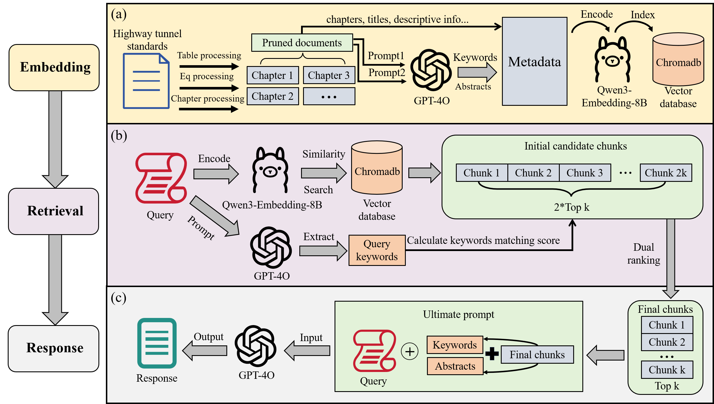

# iS3 Tunnel (Enhanced_RAG) - Intelligent Retrieval-Augmented Generation System


A powerful Retrieval-Augmented Generation (RAG) system specifically designed for the iS3 tunnel project, supporting intelligent document processing, vectorized storage, and precise question answering.

**📦 Repository**: [https://github.com/shengliuyang/iS3-Tunnel](https://github.com/shengliuyang/iS3-Tunnel)

## 🚀 Project Features

### 🎯 **Intelligent Vector Database Construction Process**
- **Multi-format Document Support**: Supports TXT, PDF, Markdown, and other document formats
- **Semantic Segmentation Technology**: Intelligent text chunking based on recursive splitting and chapter recognition
- **LLM-driven Metadata Extraction**: Uses large language models to automatically extract keywords and summaries
- **Batch Processing Optimization**: Intelligent batch processing and retry mechanisms for large-scale document processing
- **Rich Metadata**: Includes document types, chapter information, timestamps, and other multi-dimensional metadata

### 🏗️ **Enhanced RAG Architecture Highlights**
- **Modular Design**: Clear module separation for easy maintenance and extension
- **Hybrid Retrieval Strategy**: Semantic retrieval + keyword matching + metadata sorting
- **Context Enhancement**: Rich metadata information improves retrieval quality
- **Configurable Parameters**: Supports flexible configuration of top_k, weights, and other parameters
- **Multi-template Support**: Supports various template types including Q&A, analysis, and comparison

### 🔍 **Enhanced RAG Search Strategy Highlights**
- **Multi-dimensional Relevance Calculation**: Combines semantic similarity and keyword overlap
- **Dynamic Weight Adjustment**: Automatically adjusts retrieval strategies based on query types
- **Intelligent Re-ranking**: Results re-ranking based on multi-dimensional features
- **LLM Keyword Extraction**: Uses large language models to extract query keywords for improved matching accuracy

## 📁 Project Structure

```
iS3-Tunnel/
├── README.md                    # English documentation (main)
├── README_CN.md                 # Chinese documentation
├── requirements.txt             # Dependencies list
├── env_example.txt              # Environment variables example
├── .gitignore                   # Git ignore file
├── config/                      # Configuration management
│   ├── settings.py              # Unified configuration management
│   └── logging_config.py        # Logging configuration
├── src/                         # Core source code
│   ├── core/                    # Core modules
│   │   ├── llm_client.py        # LLM client encapsulation
│   │   ├── embeddings.py        # Vector embedding models
│   │   └── vector_store.py      # Vector database operations
│   ├── processors/              # Processor modules
│   │   ├── text_processor.py    # Text processing core
│   │   ├── document_loader.py   # Document loader
│   │   └── metadata_extractor.py # Metadata extraction
│   ├── retrieval/               # Retrieval modules
│   │   ├── enhanced_retriever.py # Enhanced retriever
│   │   ├── keyword_matcher.py   # Keyword matching
│   │   └── reranker.py          # Re-ranker
│   ├── qa/                      # Q&A modules
│   │   ├── qa_chain.py          # Q&A chain
│   │   └── prompt_templates.py  # Prompt templates
│   └── utils/                   # Utility modules
│       ├── file_utils.py        # File utilities
│       ├── progress_tracker.py  # Progress tracking
│       └── error_handler.py     # Error handling
├── scripts/                     # Script files
│   ├── build_vector_db.py       # Build vector database
│   └── run_qa.py               # Run Q&A system
├── data/                        # Data directory
│   ├── raw/                     # Raw documents
│   ├── processed/               # Processed documents
│   └── vector_db/               # Vector database storage
├── tests/                       # Test files
├── docs/                        # Documentation
└── examples/                    # Usage examples
```

## 🛠️ Installation and Usage

### Environment Requirements
- Python 3.8+
- Ollama (for local embedding models)
- Azure OpenAI API (for LLM calls)

### Main Dependency Versions
- LangChain: 0.3.26
- ChromaDB: 1.0.15
- OpenAI: 1.93.0
- Ollama: 0.5.1
- Pandas: 2.3.0
- NumPy: 1.26.4

### Installation Steps

1. **Clone the project**
```bash
git clone https://github.com/shengliuyang/iS3-Tunnel.git
cd iS3-Tunnel
```

2. **Install dependencies**
```bash
pip install -r requirements.txt
```

3. **Configure environment variables**
```bash
cp env_example.txt .env
# Edit the .env file with your configuration information
```

4. **Install and start Ollama service**
```bash
# Install Ollama (if not already installed)
# For Windows: Download from https://ollama.ai/download
# For macOS: brew install ollama
# For Linux: curl -fsSL https://ollama.ai/install.sh | sh

# Start Ollama service
ollama serve

# Download the required embedding model
ollama pull dengcao/Qwen3-Embedding-8B:Q8_0
```

5. **Verify installation**
```bash
# Test if Ollama is running
curl http://localhost:11434/api/tags

# Test if the embedding model is available
python -c "from src.core.embeddings import EmbeddingModel; print('Embedding model loaded successfully')"
```

### Usage

#### 1. Build Vector Database
```bash
# Build vector database from document folder
python scripts/build_vector_db.py /path/to/your/documents --clear

# Custom parameters
python scripts/build_vector_db.py /path/to/your/documents \
    --collection my_collection \
    --min-chunk-size 200 \
    --max-chunk-size 1500 \
    --chunk-overlap 300

# Available parameters:
# --clear: Clear existing collection before building
# --collection: Specify collection name (default: rag_db)
# --min-chunk-size: Minimum chunk size (default: 200)
# --max-chunk-size: Maximum chunk size (default: 1500)
# --chunk-overlap: Chunk overlap size (default: 300)
# --batch-size: Processing batch size (default: 10)
```

#### 2. Run Q&A System
```bash
# Interactive Q&A
python scripts/run_qa.py --mode interactive

# Single question Q&A
python scripts/run_qa.py --mode single --question "Your question"

# Batch Q&A
python scripts/run_qa.py --mode batch \
    --question-file questions.txt \
    --output-file answers.txt

# Available modes:
# interactive: Interactive Q&A session
# single: Answer a single question
# batch: Process multiple questions from a file
```

#### 3. Programming Interface Usage
```python
from src.core.vector_store import VectorStore
from src.retrieval.enhanced_retriever import EnhancedRetriever
from src.qa.qa_chain import QAChain

# Initialize components
vector_store = VectorStore("my_collection")
retriever = EnhancedRetriever(vector_store)
qa_chain = QAChain(retriever)

# Answer questions
answer = qa_chain.answer_question("Your question")
print(answer)

# Advanced usage with custom parameters
answer = qa_chain.answer_question(
    "Your question",
    top_k=5,
    semantic_weight=0.7,
    keyword_weight=0.3
)
```

## 🔧 Configuration

### Environment Variables Configuration
```bash
# Azure OpenAI Configuration
AZURE_OPENAI_KEY=your_azure_openai_key
AZURE_OPENAI_ENDPOINT=https://your-resource.openai.azure.com
AZURE_OPENAI_DEPLOYMENT=gpt-4o
AZURE_OPENAI_API_VERSION=2024-08-01-preview

# Ollama Configuration
OLLAMA_BASE_URL=http://localhost:11434
OLLAMA_EMBEDDING_MODEL=dengcao/Qwen3-Embedding-8B:Q8_0

# Vector Database Configuration
CHROMA_DB_DIR=./data/vector_db
COLLECTION_NAME=rag_db

# Processing Configuration
MIN_CHUNK_SIZE=200
MAX_CHUNK_SIZE=1500
CHUNK_OVERLAP=300
BATCH_SIZE=10
```

## 📊 iS3 Tunnel Enhanced RAG System Architecture



**Figure: iS3 Tunnel RAG Workflow**
- Multi-format document ingestion and semantic chunking
- Vectorization and storage in ChromaDB
- Hybrid retrieval combining semantic and keyword search
- LLM-based answer generation with context enhancement

## 🤖 iS3 Tunnel Intelligent Agent Architecture


**Figure: iS3 Tunnel Intelligent Agent Workflow**
- The intelligent agent orchestrates multi-step reasoning and tool use
- Integrates RAG retrieval, LLM planning, and external tool invocation
- Supports complex, multi-turn, and tool-augmented queries
- Enables advanced tunnel engineering Q&A and decision support

**About the Agent:**
The iS3 Tunnel Intelligent Agent is an advanced extension built on top of the RAG system. It leverages the RAG knowledge base, LLM reasoning, and external tools to solve complex, multi-step engineering problems. The agent can plan, retrieve, and synthesize information, making it suitable for expert-level tunnel engineering Q&A, workflow automation, and intelligent decision support.

## 🎯 iS3 Tunnel Enhanced RAG Core Features

### 1. Intelligent Document Processing
- **Multi-format Support**: Automatically recognizes and processes TXT, PDF, Markdown, and other formats
- **Semantic Segmentation**: Intelligent chunking based on chapter structure and semantic boundaries
- **Metadata Extraction**: Uses LLM to automatically extract keywords, summaries, and document types

### 2. Enhanced Retrieval System
- **Hybrid Retrieval**: Combines semantic similarity and keyword matching
- **Dynamic Weights**: Automatically adjusts retrieval strategies based on query types
- **Intelligent Re-ranking**: Results sorting based on multi-dimensional features

### 3. Flexible Q&A System
- **Multi-template Support**: Q&A, analysis, comparison, and other template types
- **Context Enhancement**: Rich metadata information improves answer quality
- **Batch Processing**: Supports batch Q&A and result export

## 🔍 iS3 Tunnel Enhanced RAG Technical Highlights

### 1. LLM-driven Metadata Extraction
- Uses Azure OpenAI to automatically extract document keywords and summaries
- Intelligent document type recognition and chapter structure analysis
- Deep semantic understanding support for Chinese documents

### 2. Hybrid Retrieval Strategy
- Semantic retrieval: Content matching based on vector similarity
- Keyword matching: Based on LLM-extracted keyword overlap
- Metadata sorting: Combines document types, timestamps, and other metadata

### 3. Extensible Architecture
- Modular design for easy feature extension
- Unified configuration management and error handling
- Comprehensive logging and progress tracking

## 📈 Performance Optimization

- **Batch Processing**: Intelligent batch processing reduces API call frequency
- **Retry Mechanism**: Automatic retry and error recovery
- **Caching Strategy**: Vector database persistent storage
- **Memory Optimization**: Streaming processing for large documents

## 🤝 Contributing

Welcome to submit Issues and Pull Requests to improve the project!

1. Fork the project
2. Create a feature branch (`git checkout -b feature/AmazingFeature`)
3. Commit your changes (`git commit -m 'Add some AmazingFeature'`)
4. Push to the branch (`git push origin feature/AmazingFeature`)
5. Open a Pull Request

## 📄 License

This project is licensed under the MIT License - see the [LICENSE](LICENSE) file for details.

## 🙏 Acknowledgments

- [LangChain](https://github.com/langchain-ai/langchain) (v0.3.26) - Powerful LLM application framework
- [ChromaDB](https://github.com/chroma-core/chroma) (v1.0.15) - Efficient vector database
- [Ollama](https://github.com/ollama/ollama) (v0.5.1) - Local LLM runtime environment
- [Azure OpenAI](https://azure.microsoft.com/en-us/products/ai-services/openai-service) - Enterprise-grade AI services

---

**Note**: Please ensure that Azure OpenAI API keys and Ollama services are properly configured before use.

---

**中文**: 如需中文文档，请查看 [README_CN.md](README_CN.md).

---

## 👨‍💻 Author

**Liuyang Sheng**  
Tongji University  
Email: 2252056@tongji.edu.cn

**Co-author:**  
Huaiyuan Sun  
Tongji University  
Email: 2310413@tongji.edu.cn

*This project is developed as part of the iS3 tunnel project research at Tongji University.* 

