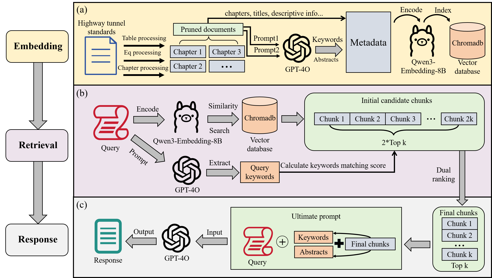

# iS3 Tunnel (Enhanced_RAG) - 智能检索增强生成系统


一个功能强大的检索增强生成（RAG）系统，专为iS3隧道项目设计，支持智能文档处理、向量化存储和精准问答。

**📦 项目仓库**: [https://github.com/shengliuyang/iS3-Tunnel](https://github.com/shengliuyang/iS3-Tunnel)

## 🚀 项目特色

### 🎯 **智能向量数据库建立过程**
- **多格式文档支持**: 支持TXT、PDF、Markdown等多种文档格式
- **语义分割技术**: 基于递归分割和章节识别的智能文本分块
- **LLM驱动的元数据提取**: 使用大模型自动提取关键词和摘要
- **批量处理优化**: 智能批处理和重试机制，支持大规模文档处理
- **丰富的元数据**: 包含文档类型、章节信息、时间戳等多维度元数据

### 🏗️ **Enhanced RAG架构亮点**
- **模块化设计**: 清晰的模块分离，便于维护和扩展
- **混合检索策略**: 语义检索 + 关键词匹配 + 元数据排序
- **上下文增强**: 丰富的元数据信息提升检索质量
- **可配置参数**: 支持top_k、权重调整等灵活配置
- **多模板支持**: 支持问答、分析、对比等多种模板类型

### 🔍 **Enhanced RAG搜索策略亮点**
- **多维度相关性计算**: 结合语义相似度和关键词重叠度
- **动态权重调整**: 根据查询类型自动调整检索策略
- **智能重排序**: 基于多维度特征的结果重排序
- **LLM关键词提取**: 使用大模型提取查询关键词，提升匹配精度

## 📁 项目结构

```
iS3-Tunnel/
├── README.md                    # 英文项目说明文档（主要）
├── README_CN.md                 # 中文项目说明文档
├── requirements.txt             # 依赖包列表
├── env_example.txt              # 环境变量示例
├── .gitignore                   # Git忽略文件
├── config/                      # 配置管理
│   ├── settings.py              # 统一配置管理
│   └── logging_config.py        # 日志配置
├── src/                         # 核心源码
│   ├── core/                    # 核心模块
│   │   ├── llm_client.py        # LLM客户端封装
│   │   ├── embeddings.py        # 向量嵌入模型
│   │   └── vector_store.py      # 向量数据库操作
│   ├── processors/              # 处理器模块
│   │   ├── text_processor.py    # 文本处理核心
│   │   ├── document_loader.py   # 文档加载器
│   │   └── metadata_extractor.py # 元数据提取
│   ├── retrieval/               # 检索模块
│   │   ├── enhanced_retriever.py # 增强检索器
│   │   ├── keyword_matcher.py   # 关键词匹配
│   │   └── reranker.py          # 重排序器
│   ├── qa/                      # 问答模块
│   │   ├── qa_chain.py          # 问答链
│   │   └── prompt_templates.py  # 提示模板
│   └── utils/                   # 工具模块
│       ├── file_utils.py        # 文件工具
│       ├── progress_tracker.py  # 进度跟踪
│       └── error_handler.py     # 错误处理
├── scripts/                     # 脚本文件
│   ├── build_vector_db.py       # 构建向量数据库
│   └── run_qa.py               # 运行问答系统
├── data/                        # 数据目录
│   ├── raw/                     # 原始文档
│   ├── processed/               # 处理后的文档
│   └── vector_db/               # 向量数据库存储
├── tests/                       # 测试文件
├── docs/                        # 文档
└── examples/                    # 使用示例
```

## 🛠️ 安装和使用

### 环境要求
- Python 3.8+
- Ollama (用于本地embedding模型)
- Azure OpenAI API (用于LLM调用)

### 主要依赖版本
- LangChain: 0.3.26
- ChromaDB: 1.0.15
- OpenAI: 1.93.0
- Ollama: 0.5.1
- Pandas: 2.3.0
- NumPy: 1.26.4

### 安装步骤

1. **克隆项目**
```bash
git clone https://github.com/shengliuyang/iS3-Tunnel.git
cd iS3-Tunnel
```

2. **安装依赖**
```bash
pip install -r requirements.txt
```

3. **配置环境变量**
```bash
cp env_example.txt .env
# 编辑 .env 文件，填入你的配置信息
```

4. **启动Ollama服务**
```bash
# 确保Ollama服务运行在 http://localhost:11434
# 并下载所需的embedding模型
ollama pull dengcao/Qwen3-Embedding-8B:Q8_0
```

### 使用方法

#### 1. 构建向量数据库
```bash
# 从文档文件夹构建向量数据库
python scripts/build_vector_db.py /path/to/your/documents --clear

# 自定义参数
python scripts/build_vector_db.py /path/to/your/documents \
    --collection my_collection \
    --min-chunk-size 200 \
    --max-chunk-size 1500 \
    --chunk-overlap 300
```

#### 2. 运行问答系统
```bash
# 交互式问答
python scripts/run_qa.py --mode interactive

# 单个问题问答
python scripts/run_qa.py --mode single --question "你的问题"

# 批量问答
python scripts/run_qa.py --mode batch \
    --question-file questions.txt \
    --output-file answers.txt
```

#### 3. 编程接口使用
```python
from src.core.vector_store import VectorStore
from src.retrieval.enhanced_retriever import EnhancedRetriever
from src.qa.qa_chain import QAChain

# 初始化组件
vector_store = VectorStore("my_collection")
retriever = EnhancedRetriever(vector_store)
qa_chain = QAChain(retriever)

# 回答问题
answer = qa_chain.answer_question("你的问题")
print(answer)
```

## 🔧 配置说明

### 环境变量配置
```bash
# Azure OpenAI 配置
AZURE_OPENAI_KEY=your_azure_openai_key
AZURE_OPENAI_ENDPOINT=https://your-resource.openai.azure.com
AZURE_OPENAI_DEPLOYMENT=gpt-4o
AZURE_OPENAI_API_VERSION=2024-08-01-preview

# Ollama 配置
OLLAMA_BASE_URL=http://localhost:11434
OLLAMA_EMBEDDING_MODEL=dengcao/Qwen3-Embedding-8B:Q8_0

# 向量数据库配置
CHROMA_DB_DIR=./data/vector_db
COLLECTION_NAME=rag_db

# 处理配置
MIN_CHUNK_SIZE=200
MAX_CHUNK_SIZE=1500
CHUNK_OVERLAP=300
BATCH_SIZE=10
```

## 📊 iS3 Tunnel Enhanced RAG系统架构图



**图：iS3 Tunnel RAG整体流程**
- 多格式文档接入与语义分块
- ChromaDB向量化存储
- 语义检索与关键词检索混合召回
- LLM上下文增强与答案生成

## 🤖 iS3 Tunnel 智能体架构


**图：iS3 Tunnel智能体工作流**
- 智能体自动编排多步推理与工具调用
- 集成RAG检索、LLM规划与外部工具
- 支持复杂、多轮、工具增强型查询
- 赋能隧道工程高级问答与决策支持

**智能体简介：**
iS3 Tunnel智能体是在RAG系统基础上开发的高级智能体，结合RAG知识库、LLM推理与外部工具，能够解决复杂多步工程问题。智能体具备规划、检索、综合能力，适用于专家级隧道工程问答、流程自动化与智能决策支持。

## 🎯 iS3 Tunnel Enhanced RAG核心功能

### 1. 智能文档处理
- **多格式支持**: 自动识别和处理TXT、PDF、Markdown等格式
- **语义分割**: 基于章节结构和语义边界的智能分块
- **元数据提取**: 使用LLM自动提取关键词、摘要和文档类型

### 2. 增强检索系统
- **混合检索**: 结合语义相似度和关键词匹配
- **动态权重**: 根据查询类型自动调整检索策略
- **智能重排序**: 基于多维度特征的结果排序

### 3. 灵活问答系统
- **多模板支持**: 问答、分析、对比等多种模板
- **上下文增强**: 丰富的元数据信息提升回答质量
- **批量处理**: 支持批量问答和结果导出

## 🔍 iS3 Tunnel Enhanced RAG技术亮点

### 1. LLM驱动的元数据提取
- 使用Azure OpenAI自动提取文档关键词和摘要
- 智能文档类型识别和章节结构分析
- 支持中文文档的深度语义理解

### 2. 混合检索策略
- 语义检索：基于向量相似度的内容匹配
- 关键词匹配：基于LLM提取的关键词重叠度
- 元数据排序：结合文档类型、时间等元数据

### 3. 可扩展架构
- 模块化设计，便于功能扩展
- 统一的配置管理和错误处理
- 完善的日志记录和进度跟踪

## 📈 性能优化

- **批量处理**: 智能批处理减少API调用次数
- **重试机制**: 自动重试和错误恢复
- **缓存策略**: 向量数据库持久化存储
- **内存优化**: 流式处理大文档

## 🤝 贡献指南

欢迎提交Issue和Pull Request来改进项目！

1. Fork 项目
2. 创建功能分支 (`git checkout -b feature/AmazingFeature`)
3. 提交更改 (`git commit -m 'Add some AmazingFeature'`)
4. 推送到分支 (`git push origin feature/AmazingFeature`)
5. 打开 Pull Request

## 📄 许可证

本项目采用 MIT 许可证 - 查看 [LICENSE](LICENSE) 文件了解详情。

## 🙏 致谢

- [LangChain](https://github.com/langchain-ai/langchain) (v0.3.26) - 强大的LLM应用框架
- [ChromaDB](https://github.com/chroma-core/chroma) (v1.0.15) - 高效的向量数据库
- [Ollama](https://github.com/ollama/ollama) (v0.5.1) - 本地LLM运行环境
- [Azure OpenAI](https://azure.microsoft.com/en-us/products/ai-services/openai-service) - 企业级AI服务

---

**注意**: 使用前请确保已正确配置Azure OpenAI API密钥和Ollama服务。

---

**English**: For English documentation (main), please see [README.md](README.md).

---

## 👨‍💻 作者

**盛柳洋**  
同济大学  
邮箱: 2252056@tongji.edu.cn

**共同作者：**  
**孙怀远**  
同济大学  
邮箱: 2310413@tongji.edu.cn

*本项目是同济大学iS3隧道项目研究的一部分。* 

